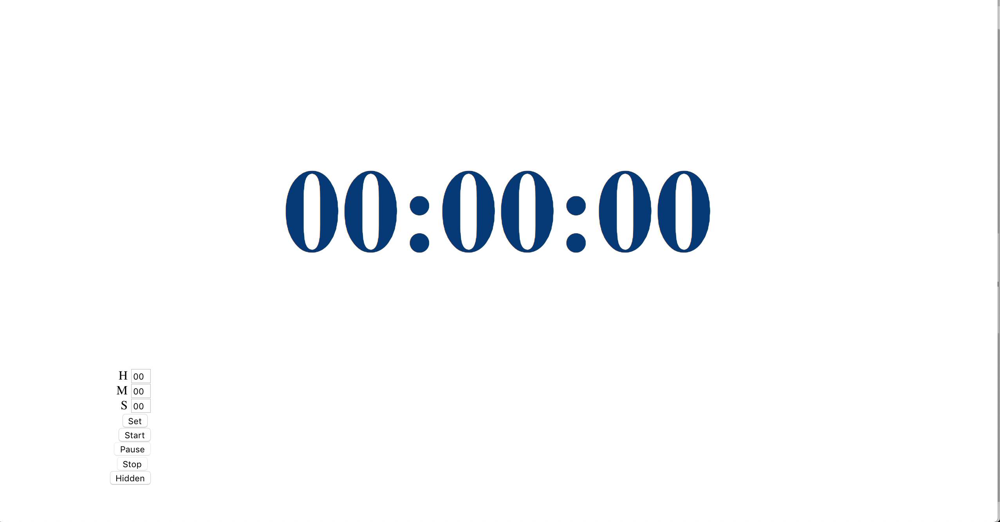

# 计时器

## 说明
纯html+js+css编写，倒计时，浏览器打开使用

## 使用
1. 浏览器打开timer.html。建议chrome
2. 输入倒计时时间，支持，时，分，秒。点击设置
3. 点击开始，则开始倒计时
4. 点击隐藏，可将控制面板隐藏
5. 点击时间数字或页面上任何鼠标箭头出现手型的位置，即可再次调出倒计时

## 用途
* 最初是给某公司歌手竞赛提供倒计时使用
* ppt讲解倒计时
* 辩论倒计时

## 界面如下，可根据需要调整

